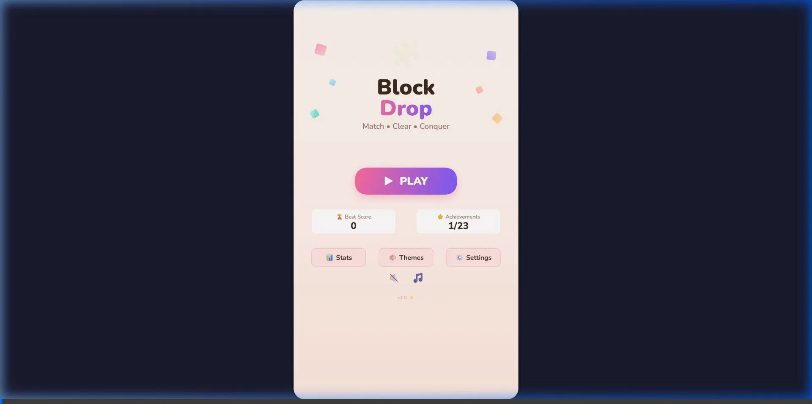
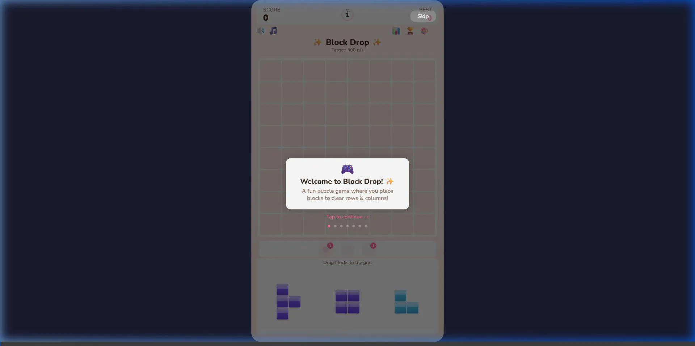

# 🧩 Block Drop

> A beautifully polished, addictive block puzzle game built entirely with Vanilla JavaScript and HTML5 Canvas.
> 
> **[🚀 PLAY THE GAME LIVE HERE!](https://firmanwazir.github.io/Html5-Block-Puzzle/)**

<p align="center">
  
  
</p>

**Block Drop** is a fast-paced, strategic puzzle game where players drag and drop block pieces onto a grid to clear rows and columns. Match multiple lines to score massive combos, level up, unlock power-ups, and discover new aesthetic themes!

## ✨ Features

- 🎮 **Classic Puzzle Gameplay**: Intuitive drag-and-drop mechanics with a sleek modern feel.
- 💥 **Combo System**: Clear multiple lines sequentially or simultaneously for big score multipliers.
- 🚀 **Power-Ups**: 
  - 💣 **Bomb**: Clear a 3x3 area instantly.
  - 🌈 **Color Blast**: Erase all blocks of a specific color from the board.
  - ↩️ **Undo**: Made a mistake? Rewind your last move!
- 🎨 **Unlockable Themes**: Play and progress to unlock 6 beautifully crafted themes including Sakura, Midnight, Neon, and more.
- 🏆 **Achievements & Stats**: Track your high scores, max combos, and unlock over 20+ badges.
- 🌍 **Bilingual (i18n)**: Fully supports both **English** and **Bahasa Indonesia**.
- 💾 **Local Storage**: All your progress, themes, and settings are saved locally in the browser.
- 📱 **Mobile-Friendly**: Fully responsive and optimized for touch devices.

## 🛠️ Technology Stack

This game is built **100% from scratch** without any external game engines or frameworks. It demonstrates a deep understanding of core web technologies and game architecture.

- **HTML5 Canvas**: For high-performance rendering of the grid, blocks, modal UI, and custom particle systems.
- **Vanilla JavaScript (ES6+)**: Custom state machine, object-oriented UI components, event handling, and pure mathematical game logic.
- **Vanilla CSS3**: Layout styling and font imports.
- **Web Audio API**: Dynamic sound effects and background music synchronization.

## 🚀 How to Run Locally

Since this is a vanilla web application without any complex build steps or external dependencies, running it locally is incredibly simple.

**Option 1: The Easy Way**
1. Clone the repository:
   ```bash
   git clone https://github.com/firmanwazir/Html5-Block-Puzzle.git
   ```
2. Navigate to the project folder and simply double-click the `index.html` file to open it directly in your browser!

**Option 2: Using a Local Server (Optional)**
If you prefer running it through a local development server:
1. Navigate to the project directory in your terminal.
2. Start a local server (e.g., using `npx`):
   ```bash
   npx http-server . -p 8080
   ```
3. Open your browser and visit `http://localhost:8080`.

## 🕹️ How to Play

1. Drag blocks from the tray at the bottom onto the grid.
2. Complete a full row or column to clear the blocks and earn points.
3. Keep clearing lines back-to-back to build up a **Combo**.
4. Earn **Bombs** by clearing 3+ lines at once, and **Color Blasts** by reaching Combo x3!
5. Reach the target score to **Level Up** and earn the **Undo** power-up.
6. The game is over when there is no more space on the grid to place any of the pieces in your tray.


